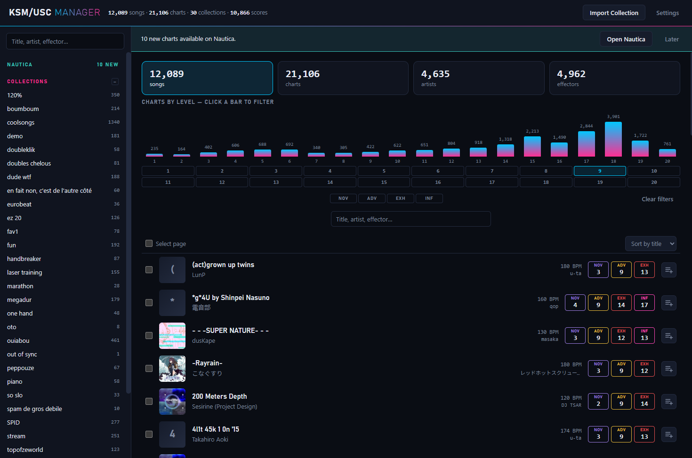
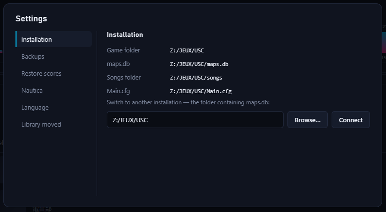
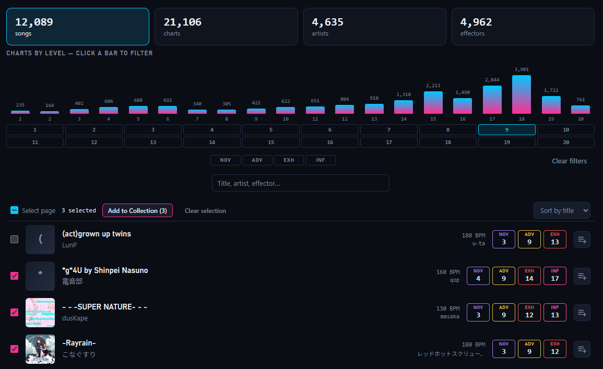
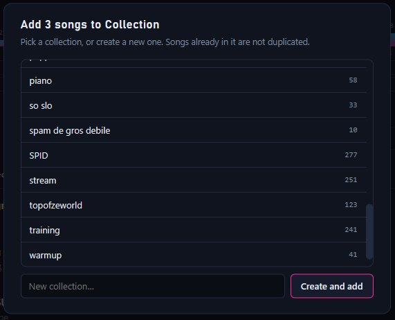
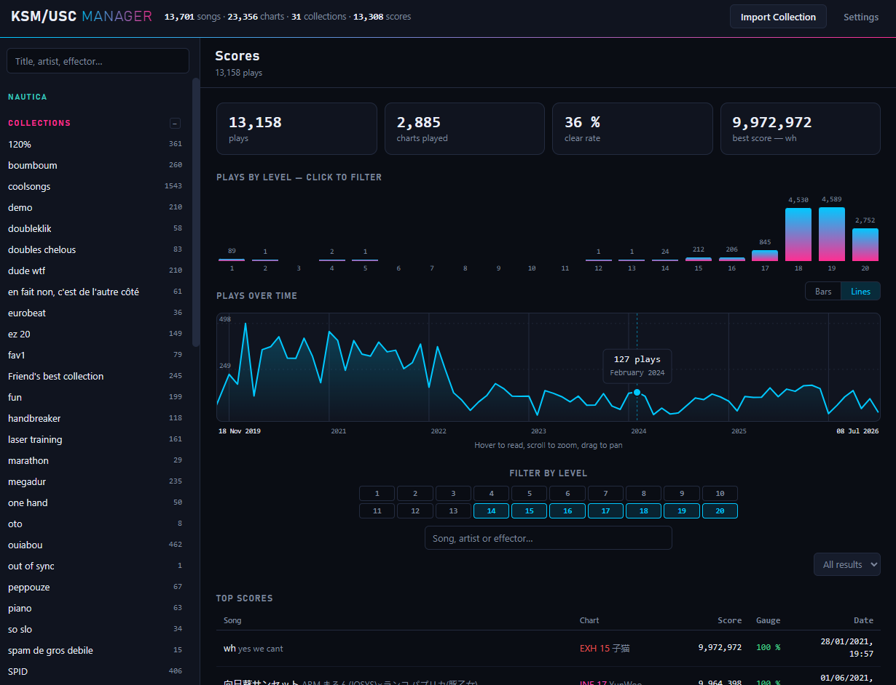
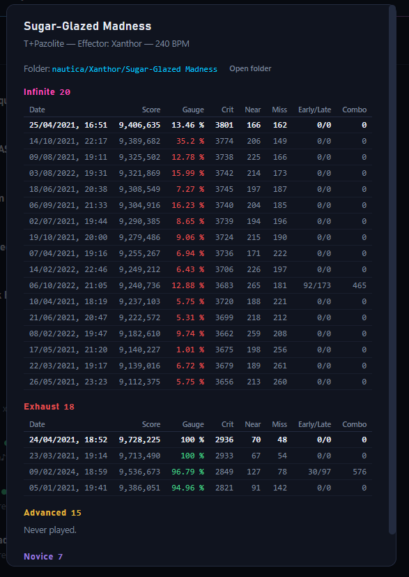
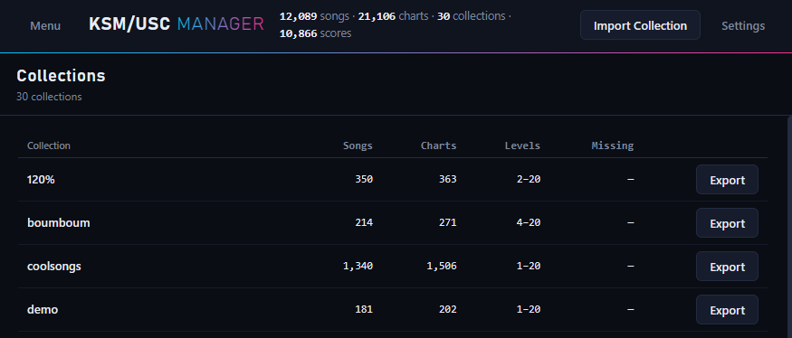
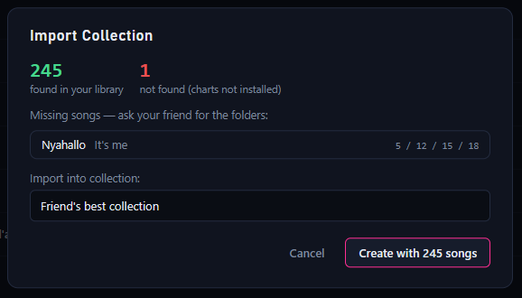
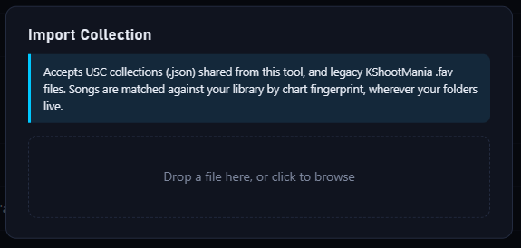

# KSM/USC Manager

Local web tool to manage the song database of [USC](https://github.com/Drewol/unnamed-sdvx-clone) (`maps.db`):
browse your library, manage collections (the game's playlists), check score history, listen to previews —
and **share playlists with friends** as portable files that survive different install paths.

No Node, no build step, no external dependency. PHP 8.1+ and a browser.

> **⬇ Windows, no PHP installed?** Grab the **portable bundle** from the
> [Releases page](https://github.com/ouarss/ksm-usc-manager/releases): unzip
> anywhere, double-click `start.bat` — PHP is included, nothing to install.



## Why this exists

USC stores everything about your library in `maps.db` — including **absolute
folder paths**. This tool grew out of three needs, in that order:

1. **Surviving a library move.** Move or rename your game folder (new drive,
   new machine…) and the game loses every song — and if it rescans before the
   paths are fixed, it silently corrupts your collections too. The tool audits
   all of this at startup and fixes it in one click, with automatic backups
   first. See [Moving your game install](#moving-your-game-install-audit--fix).
2. **Actually managing collections.** The in-game UI can add a song to a
   collection, but not rename, merge, delete, bulk-add hundreds of songs from
   a filtered search, or see what a collection contains at a glance. That is
   the core of this tool.
3. **Sharing collections between friends.** Raw collections are useless
   outside your machine (they reference your absolute paths). Exported
   collections store each chart's **hash** — a fingerprint of the chart file
   itself, the same key the game uses for scores. Importing matches those
   hashes against the *other* library, so it works whatever the folder
   layout, drive letter or pack names on either side. Missing charts are
   listed instead of silently dropped.

## Launch

**Portable bundle (Windows)** — see the download note at the top: unzip,
double-click `start.bat`, done.

**Windows, from source** — double-click `start.bat` (needs PHP in PATH), or from a terminal:

```
php -S 127.0.0.1:2901 -t public
```

**Apache / nginx** — point the web root at the `public/` folder (only it is
web-served; `src/`, `data/` and `backups/` stay out of reach by construction).

**Linux** — same: `php -S 127.0.0.1:2901 -t public` from the repo root, or any
PHP-capable web server.

On first launch, point the tool to your game folder (the one containing `maps.db`).
It is saved in `data/settings.json`.



## Moving your game install (audit & fix)

`maps.db` stores **absolute paths**, and collections reference songs through a
volatile row id. Moving or copying the game folder therefore breaks things in
several ways — the tool audits all of them at startup and shows a banner with
a **Fix everything** button (full database backup first) when something is off:

- **Paths mismatch** — the database still points at the old location. Fix:
  the path prefixes in `Folders`/`Charts` are rewritten in place.
- **Stale `Main.cfg`** — its `SongFolder` names a folder that no longer
  exists. The game scans that value literally, so its next scan would index
  *nothing*. Fix: `SongFolder` is rewritten onto the real songs folder
  (the original is kept as `Main.cfg.bak`).
- **Diverged favorites** — if the game already rescanned after the move, it
  deleted and re-inserted every folder row, *recycling the row ids*: your
  collections keep the right song **count** but point at the **wrong songs**
  (scores are safe — they are keyed by chart hash, not by row id). The tool
  detects this by comparing each collection to its `.fav` mirror (relative
  paths, immune to the move) and restores the collection from the mirror —
  per collection on the Collections page, or all at once via Fix everything.
  The reverse button ("Rewrite .fav") exists for the rare case where the
  mirror, not the database, is the stale side.

**The right order after a move:**

1. Close the game, move/copy the install.
2. Open the tool **before launching the game** and apply the fixes. Then
   launch the game: its scan finds matching paths, rebuilds nothing, and
   favorites and scores are intact. No re-index is needed.
3. Launched the game first and favorites got scrambled? Open the tool: it
   flags the diverged collections and restores them from their `.fav` mirrors
   in one click. No re-index afterwards either — just start the game normally.

Special case: if `Main.cfg` pointed at a dead folder and the game already
"indexed" an empty library, fix it, **launch the game once** so it rebuilds
the index, then reopen the tool and restore the collections it flags as
diverged. And always close the game while fixing — it holds `maps.db`.

## Browsing & collecting

The Explorer browses the whole library by songs, charts, artists or effectors —
filter by level (click a bar), difficulty or free text, select songs across
pages and add them to a collection in one go.





## Scores & stats

The **Scores** page reads your play history as a whole: totals and clear rate,
plays by level (click a bar to filter), plays over time (hover to read, scroll
to zoom, drag to pan) and the top scores table.



Clicking a song opens its details with the full play history per difficulty
(score, gauge, crit/near/miss, combo) and a link to its folder.



## Sharing collections



- Open a collection → **Share** downloads a `.usc-collection.json` file.
- Your friend clicks **Import Collection** and drops the file: songs are matched
  against *their* library by chart hash (with title/artist fallback), whatever their
  folder layout. Missing charts are listed so they know what to ask for.



- Nobody to trade with yet? [`media/topofzeworld.json`](media/topofzeworld.json)
  is a real export (121 songs) — download it and drop it on **Import
  Collection**: the preview shows which of its charts your library already has,
  and lists the rest.
- Legacy KShootMania `.fav` files can be imported too.



- Every collection is also mirrored to a `.fav` file in the songs folder,
  kept in sync automatically — it survives a `maps.db` rebuild, and it is what
  the tool uses to detect and repair collections corrupted by a re-index
  (see [Moving your game install](#moving-your-game-install-audit--fix)).

## Safety

- The tool writes only to the `Collections` table (plus `Folders`/`Charts`
  paths and `Main.cfg` if you use the explicit move fixers — each with its
  own backup first).
- An automatic backup of `maps.db` is made before the first write of each day, plus
  manual backups on demand — all in `backups/`.
- Close the game before making changes: it may hold the database.

## License

[MIT](LICENSE)
